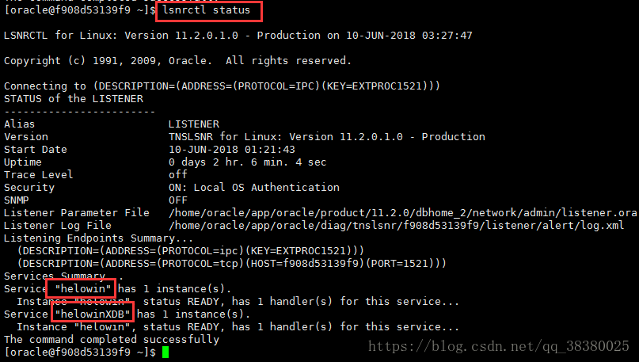

# docker 安装工具

* [相关命令](./command.md)
* [安装使用（nginx，tomcat，mysql，oracle 11g）](./install.md)
* [容器使用](./container-usage.md)
* [镜像使用](./image-usage.md)
* [容器链接](./container-connection.md)


### nginx

> 拉取 nginx 镜像
        
    docker pull nginx

> 运行 nginx

    docker run -d -p 3006:80 --name wechat-sell-nginx -v /home/dev/web/wechat-sell:/usr/share/nginx/html nginx

### tomcat

> 拉取 tomcat 镜像

    docker pull tomcat

> 运行 tomcat 镜像

    docker run -d -p 80:8080 --name sell-server -v /home/sell/webapps:/usr/local/tomcat/webapps/ tomcat  

### Redis

> 1、 拉取 redis 镜像
    
    docker pull redis

> 2、 运行 mysql

    docker run -p 6379:6379 --name myRedis -v $PWD/data:/myRedis/data -v $PWD/conf/redis.conf:/myRedis/redis.conf -d redis redis-server --appendonly yes

命令说明：

- **-p 6379:6379** : 将容器的6379端口映射到主机的6379端口
- **-v $PWD/data:/data** : 将主机中当前目录下的data挂载到容器的/data
- **redis-server --appendonly yes** : 在容器执行redis-server启动命令，并打开redis持久化配置


> 3、 连接、查看容器

    docker exec -it myRedis redis-cli
    info

    
### mysql 8

> 1、 拉取 mysql 镜像
    
    docker pull mysql

> 2、 运行 mysql
    
    docker run --name mysql -p 3306:3306 -e MYSQL_ROOT_PASSWORD=toor123 -d mysql

* `-e MYSQL_ROOT_PASSWORD=123456：初始化root用户的密码`

> 3、 进入容器
    
    docker exec -it mysql bash

> 4、 创建新用户(用户名：dev 密码 dev123!)
    
    mysql -u root -p
    CREATE USER 'dev'@'%' IDENTIFIED WITH mysql_native_password BY 'dev123!';

> 5、 给dev用户添加远程登录权限

    GRANT ALL PRIVILEGES ON *.* TO 'dev'@'%';


### oracle 11g [原文](https://blog.csdn.net/qq_38380025/article/details/80647620)

> 1、 拉取 oracle 11g 镜像（6.8G）

	docker pull registry.cn-hangzhou.aliyuncs.com/helowin/oracle_11g

> 2、 创建容器 

	docker run -d -p 1521:1521 --name oracle11g registry.cn-hangzhou.aliyuncs.com/helowin/oracle_11g

_如果创建成功能会返回容器id_

> 3、 运行容器 

	docker start oracle11g

> 4、 进入镜像进行配置

```bash

# 进入 oracle11g bash
docker exec -it oracle11g bash

# 进行软连接(新版的镜像没有这个命令，用不了。没关系，继续下一步)
sqlplus /nolog 	

# 切换到root 用户下 （密码：helowin）
su root 					

# 编辑 profile 文件配置 ORACLE 环境变量
vi /etc/profile

export ORACLE_HOME=/home/oracle/app/oracle/product/11.2.0/dbhome_2
export ORACLE_SID=helowin
export PATH=$ORACLE_HOME/bin:$PATH

# 创建软连接
ln -s $ORACLE_HOME/bin/sqlplus /usr/bin 

# 切换到 oracle 用户
su - oracle

```

 > 5、 登录sqlplus并修改sys、system用户密码
	
	# 登录
	sqlplus /nolog
	
	# 连接
    conn /as sysdba


	创建用户 system
	alter user system identified by system;
	创建用户 sys
	alter user sys identified by sys;

	也可以创建用户  
	create user test identified by test;

	并给 test 用户赋予权限
	grant connect,resource,dba to test;

**注意了**当执行修改密码的时候出现： `database not open`  提示数据库没有打开，不急按如下操作

	alter database open;


**注意了**这里也许还会提示：`ORA-01507: database not mounted`

> 解决方法

    database mount;
	alter database open;


> 然后就可执行 修改数据库密码的命令了

    改完之后输入：ALTER PROFILE DEFAULT LIMIT PASSWORD_LIFE_TIME UNLIMITED;


> 6、使用  进行连接

打开 **navcat 或者 pl/sql** 进行登录： **提示 `ORA-12514: TNS: 监听程序当前无法识别连接描述符中请求的服务`**

这时我们需要去看一下 oracle 的 `lsnrctl` 服务



看到这两个了么，任选其一，修改 `tnsnames.ora` 的 `service_name=helowinXDB`


**之前我们把端口映射到了1521上，所以我们需要进行配置 tnsnames.ora**
	
	tnsnames.ora 文件地址是 /home/oracle/app/oracle/product/11.2.0/dbhome_2/network/admin/tnsnames.ora

将原始 tnsnames.ora：
```
docker_oracle11 =
 (DESCRIPTION =
   (ADDRESS_LIST =
     (ADDRESS = (PROTOCOL = TCP)(HOST = localhost)(PORT =1521))
   )
   (CONNECT_DATA =
     (SERVICE_NAME = orcl)
   )
)
```
tnsnames.ora 改为 如下 ：
```
docker_oracle11 =
 (DESCRIPTION =
   (ADDRESS_LIST =
     (ADDRESS = (PROTOCOL = TCP)(HOST = 192.168.211.135)(PORT =1521))
   )
   (CONNECT_DATA =
     (SERVICE_NAME = helowinXDB)
   )
)
```
