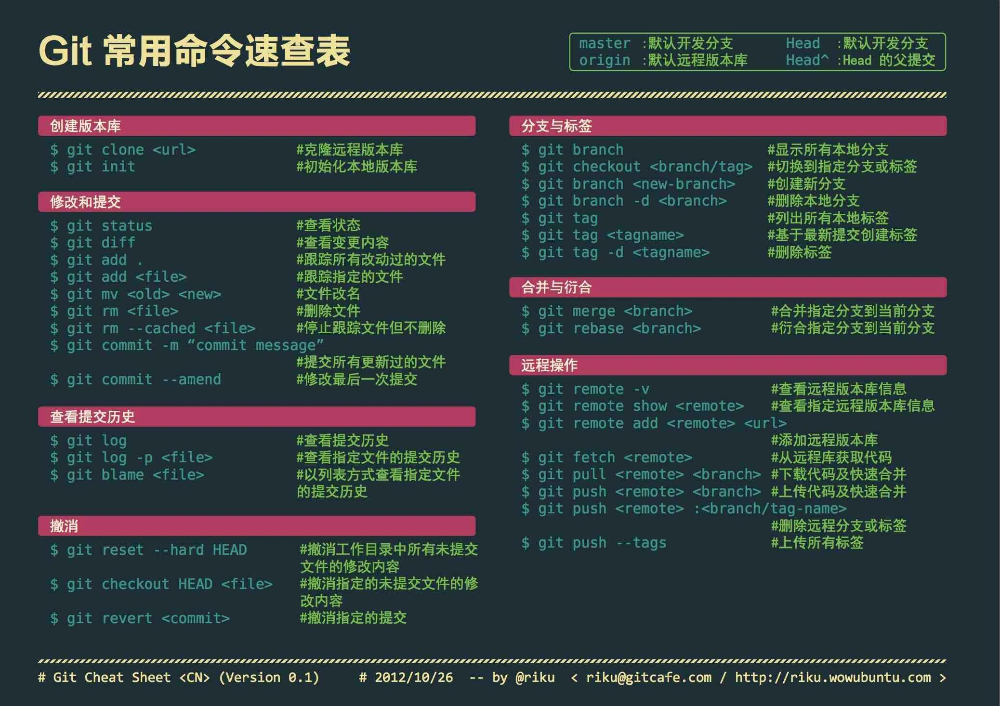

#  -----------------下面是使用git的一些心得笔记 ----------

~~能成功上传全依赖于http://www.cnblogs.com/schaepher/p/5561193.html#six~~

### git常用命令



### 使用git diff查看各个区之间的差异
> git diff 和 git diff –-cached容易混淆
```shell
    git diff                        # 比较的是工作区和暂存区的差别
    git diff –-cached               # 比较的是暂存区和版本库的差别
    git diff HEAD                   # 可以查看工作区和版本库的差别
```
> 每次commit后,git diff –-cached没有内容，是因为暂存区的内容已经更新到版本库中，因此暂存区和版本库中的内容无差别
```shell
    git rm --cached "文件路径"      # 不删除物理文件，仅将该文件从缓存中删除；
    git rm --cached "文件名"        # 可以从缓存区移除文件，使该文件变为未跟踪的状态，
    git checkout –- <file>          # 命令时，会用暂存区全部或指定的文件替换工作区的文件。
    git ls-files                    # 查看缓冲区内有哪些文件
    git rm -r --cached .            # 删除缓存区
```

### 版本回退

```shell
    git reset --hard HEADE~1    # 回滚到上一版本
    git reset --hard commit_id(版本号，版本ID，commit_id)      # 回滚到某个版本
    git reflog 	# 查看命令历史的commit_id,可以获取回退之前的commit_id,
    git reflog	# 记录这个仓库中所有的分支的所有更新记录，包括已经撤销的更新.
    
    HEAD        # 表示当前版本
    HEAD^       # 是上一个版本
    HEAD^       # ^是上上一个版本
    HEAD~100    # 100表示100个版本,100个版本写100个^比较容易数不过来。
```

#### git commit

```bash
	git reset --soft HEAD^     # 删除到HEAD^的commit，(仅commit删除，文件未变化)
	git commit --amend         # 修改最近一次的commit内容(git push过的不能修改) 
	git rebase -i HEAD~3       # 修改倒数第几次的git commit
	git rebase -i commit_id(版本号，版本ID，commit_id)    # 可以修改或删除某个commit
	git rebase --continue      # 如果修改错了要返回原来的git commit，可以使用这个命令
```

#### 上传本地文件夹到远程仓库
```bash
    1. git init     				# 本地项目根目录下执行这个命令
    2. git add .    				# 将项目的所有文件添加到仓库中
    3. git commit -m "注释语句"
    4. git remote add origin git@github.com:roy-lau/python.git     # 将本地的仓库关联到github上
    5. git pull origin master       # 上传github之前，要先pull一下
    6. git push -u origin master    # 上传代码到github远程仓库
```

### 分支类（master）

```bash
	git log --graph                 # 查看分支图
	git branch                      # 查看分支
	git branch -r                   # 查看所有远程分支
	git branch  BranchName          # 创建分支
	git checkout  BranchName        # 切换分支
	git checkout -b  BranchName     # 创建+切换分支
	git merge  BranchName           # 合并某分支到当前分支
	git branch -D  BranchName       # 删除本地分支
	git pull origin  remoteBranchName:localBranchName # 获取远程分支

	# 删除远程分支(推送一个空分支到远程分支,就相当于删除了远程分支)
	git push origin :branchName
	git push -d origin branchName

	git branch -m oldBranchName newBranchName   # 修改branch名
```

#### git 快速clone

> 1、 开始 `clone`，如果觉得仓库太大，可以在 `git clone` 中加入参数 `--depth=1`，只拉取最近的一个 `revision`。 

    git clone  git@github.com:roy-lau/web_project.git --depth=1     # 设置克隆的深度(两个参数可以连起来)
    git clone  git@github.com:roy-lau/web_project.git -b dev        # 设置克隆的分支(两个参数可以连起来)

> 2、 如果后面想看历史的版本，那么也很好办，使用 git fetch 即可。  
    
    git fetch --unshallow               # 获取除当前分支的所有历史版本

> 3、拉取远程分支到本地分支

```shell
    git fetch origin  remoteBranchName:localBranchName	
    # 如果remoteBranchName和localBranchName冲突,手动merge,可以设置深度--depth=1
    git pull origin  remoteBranchName:localBranchName	
    # 如果remoteBranchName和localBranchName冲突,自动merge,可以设置深度--depth=1
```

> 注： BranchName:分支名 localBranchName:本地分支名  remoteBranchName: 远程分支名

### 标签（tag）
	
* 创建标签
    - git tag -a `tagName` -m "注释"		# 创建附注标签(常用)
    - git tag  tagName-light  				# 创建轻量标签

* 上传标签
    - git push origin tag `tagName`  		# 将 tagName 标签提交到git服务器
    - git push origin -–tags 				# 将本地所有标签一次性提交到git服务器

* git tag   							    # 查看当前分支下的标签
* git tag -d  `tagName` 					# 删除本地标签
* git push origin `:refs/tags/tagName`  	# 删除远程标签
* git checkout `tagName` 					# 切换标签
* git tag -m oldTagName `newTagName`        # 修改tag名 
* git fetch origin tag `tagName` 		    # 获取远程tag

### 远程主机（origin）

1. 为了便于管理，git要求每个远程主机都必须指定一个主机名。不带选项的时候，```git remote```命令会列出所有远程主机。

		$ git remote
		origin

2. 使用```-v```选项可以查看远程主机的网址

    	$ git remote -v
    	origin git@github.com:roy-lau/python.git(fetch)
    	origin git@github.com:roy-lau/python.git(push)

3. 克隆的时候，所使用的远程主机自动被git命名为origin。如果想使用其他主机名，需要用```git clone```命令的```-o```选项指定。

    	$ git clone -o roy-lau https://github.com/roy-lau/python.git
    	$ git remote roy-lau

    上面命令表示，克隆的时候，指定远程主机叫roy-lau

4. ```git remote show <主机名>``` 可以查看该主机的详细信息。
5. ```git remote add <主机名><网址>```  添加远程主机。
6. ```git remote rm <主机名>``` 删除远程主机
7. ```git remote rename <源主机名> <新主机名>``` 更改远程主机名。  
End. ```git push -u <主机名> <分支名>```

### 配置类

1. `git config -l`                            查看git配置  
1. `git config -e`                            vim下修改配置  
3. `git config -–add user.name=roy-lau`       添加一个配置项命令参数  
4. `git config --get user.name`               获取一个配置项命令参数  
5. `git congig --unset user.name=roy-lau`     删除一个配置项命令参数  

* git add 的时候，中文会显示成`\344\270\255\346\226\207.txt `，使用如下命令进行配置：

        git config --global core.quotepath false

* Git使用https方式进行连接时，默认每次推送时都要输入用户名和密码。进行如下设置后，只要在推送一次，以后就不需要用户名和密码了

    	git config credential.helper store

* 设置 `git lg` （设置个命令后，使用git lg命令可以查看分支日志等！）
```bash
    git config --global alias.lg "log --color --graph --pretty=format:'%Cred%h%Creset -%C(yellow)%d%Creset %s %Cgreen(%cr) %C(bold blue)<%an>%Creset' --abbrev-commit"
```

* 设置git可提交最大bit

> 问题原因是`http.postBuffer`默认上限为`1M`所致。在git的配置里将`http.postBuffer`变量改大一些即可，比如将上限设为`500M`：

        git config --global http.postBuffer 524288000
        git sparse clone 路径  可以克隆git仓库下的某个目录

* 设置git push请求时间

> 每多少秒向主机请求链接

    Host *
    ServerAliveInterval 120 

### github的SSH配置如下：

__1. 设置Git的user name和email：__
    
        $ git config --global user.name "roy-lau"
        $ git config --global user.email "roy-lau.vip@163.com


__2. 生成SSH密钥过程：__

1. 查看是否已经有了ssh密钥：

        cd ~/.ssh
    > 如果没有密钥则不会有此文件夹，有则备份删除

2. 保存密钥：

        $ ssh-keygen -t rsa -C  "roy-lau.vip@163.com"

    按3个回车，密码为空。

    Your identification has been saved in /home/tekkub/.ssh/id_rsa.
    Your public key has been saved in /home/tekkub/.ssh/id_rsa.pub.
    The key fingerprint is:
    ………………

    > 最后得到了两个文件：`id_rsa`和`id_rsa.pub`

3. 添加密钥到 `ssh：ssh-add 文件名`

    需要之前输入密码。

4. 在github上添加ssh密钥，这要添加的是```id_rsa.pub```里面的公钥。
    
    打开https://github.com/ ，登陆roy-lau，然后添加ssh。

5. 测试：

```shell
    $ ssh -T git@github.com
    Hi roy-lau! You've successfully authenticated, but GitHub does not provide shell access.    
```

### git私服搭建

&nbsp;&nbsp;&nbsp;&nbsp;__git如何搭建私服[点击查看](git-server-build.md)__

### bug记录！

* bug1：`工作区和暂存区和远程仓库不同。但是，git push 【Everything up-to-date】`

>解决步骤如下：

```shell
1. Administrator@liuroy-lau MINGW32 /d/git_rpo/README (master)
    $ git add -A                                # 重点在这里，以前都是用git add .或git add --all

2. Administrator@liuroy-lau MINGW32 /d/git_rpo/README (master)
    $ git commit -m "error"
    [master ef2b048] error
     3 files changed, 0 insertions(+), 0 deletions(-)
     create mode 100644 git.png
     create mode 100644 git_help.png
     create mode 100644 "git\351\200\237\347\216\207.png"

3. Administrator@liuroy-lau MINGW32 /d/git_rpo/README (master)
    $ git push -u origin master
    Counting objects: 5, done.
    Delta compression using up to 4 threads.
    Compressing objects: 100% (5/5), done.
    Writing objects: 100% (5/5), 680.94 KiB | 0 bytes/s, done.
    Total 5 (delta 0), reused 0 (delta 0)
    To git@github.com:roy-lau/README.git
       792f815..ef2b048  master -> master
```


### 小技巧

1. ` git add -A `   保存所有的修改
2. ` git add . `    保存新的添加和修改，但是不包括删除
3. ` git add -u `   保存修改和删除，但是不包括新建文件。
4. 工作的时候经常需要在各个目录之间跳转，可以通过环境变量对目录进行缩写，方便地在多个目录直接切换。

在 ~/.bashrc 添加：

	export wd="/d/Projects/MyProject/git"
	export doc="/d/Projects/documents/"

以后只需要用 `cd $wd, cd $doc` 即可进入对应目录。
