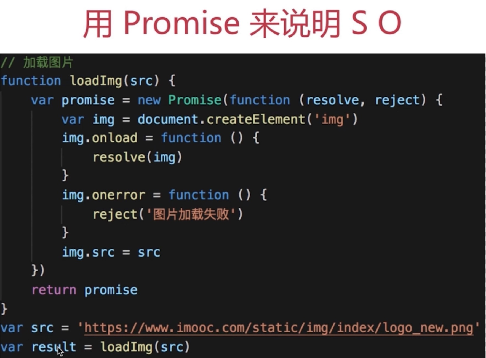
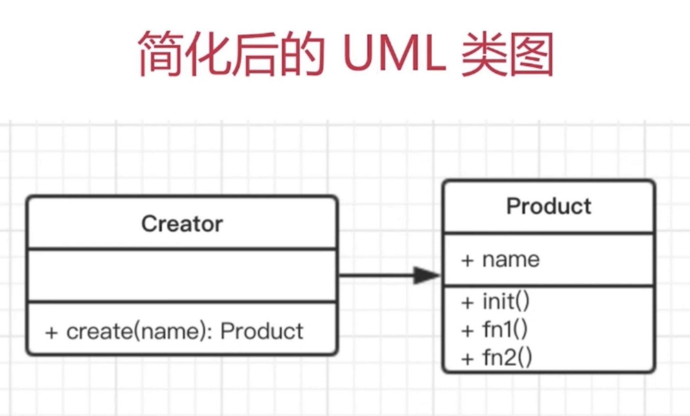
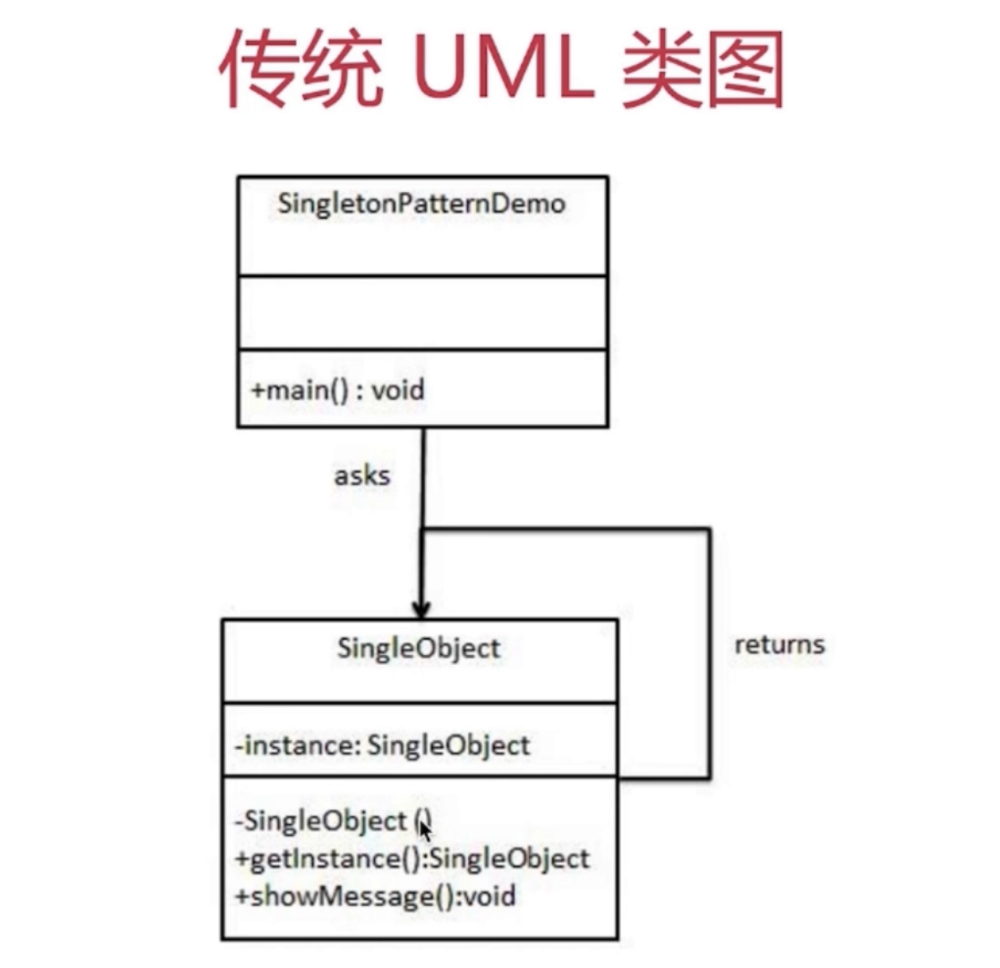

# js 设计模式

## 面向对象

### 概念

* 类

```js
// 类，即模板
class People {
    constructor(name,age){
        this.name = name
        this.age = age
    }
    eat(){
        alert(`${this.name} eat something `)
    }
    speak(){
        alert(`My name is ${this.name}, age ${this.age}`)
    }
}
```
* 对象（实例）
```js
// 创建实例(zhang)
let zhang = new People('zhang',20)
zhang.eat()
zhang.speak()

// 创建实例(wang)
let wang = new People('wang',21)
wang.eat()
wang.speak()
```

### 面向对象三要素

#### 继承: 数据的权限和保密

```js
// 父类(人)
class People(){
    constructor(name,age){
        this.name = name 
        this.age = age
    }
    eat(){
        alert(`${this.name} eat something `)
    }
    speak(){
        alert(`My name is ${this.name}, age ${this.age}`)
    }
}
// 子类(学生))继承父类(人)
class Student extends People{
    constructor(name,age,number){
        super(name,age) // 继承父类的 name 和 age
        this.number = number
    }
    study(){
        alert(`${this.name} study`)
    }
}

// 创建使用实例
let xiangming = new Student('xiangming',10,'A1')
xiangming.study()
console.log(xiangming.number)
xiangming.eat()

let xianghong = new Student('xinaghong',11,'A2')
xianghong.study()
xianghong.speak()
```
总结：
> `People` 是父类，公共的，不仅仅服务于 `Student`
> 继承可将公共的方法抽离处理，提高复用，减少冗余

#### 封装: 子类继承父类
    
> 三个关键字（ES6尚不支持，暂时使用 `typeScript` 举例）

* `public` 完全开放
* `protected` 对子类开放
* `private` 对自己开放

```typeScript
// 父类
class People{
    name // 定义 public 属性（不写public，默认就是public）
    age // 定义 public 属性（不写public，默认就是public）
    protected weight // 定义 protected 属性（对子类公开）
    constructor(name,age){
        this.name = name
        this.age = age
        this.weight = 120
    }
    eat(){
        alert(`${this.name} eat something`)
    }
    speak(){
        alert(`My name is ${this.name}, age ${this.age}`)
    }
}
// 子类
class Student exends People(){
    number // 定义 public 属性（不写public，默认就是public）
    private girlFriend // 定义 private 属性 （私有，父类子类都不能访问，只有本身可以访问）
    constructor(name,age,number){
        super(name,age)
        this.number = number
        this.girlFriend = 'xiaoli'
    }
    study(){
        alert(`${this.name} study`)
    }
    getWeight(){
        alert(`${this.weight}`)
    }
}
//实例
let xiaoming = new Student('xiangming',10,'A1')
xiangming.getWeight()   // xiangming获取自己女朋友的 weight（体重）
// console.log(xiangming.girlFriend)  // 注意：直接编译会报错，女朋友是私有的（private）
```
 总结：
> 减少耦合，不该外漏的不外漏
> 利于数据，接口的权限管理
> ES6目前不支持(ES9中支持 `#` )，js里一般认为 `_` 开头的属性是 `private`

#### 多态: 同一接口不同实现
> 同一接口，不同表现
> js 应用极少
> 需要结合 Java 等语言的接口 重写 重载等功能

```js
// 父类（人）
class People{
    constructor(name){
        this.name = name
    }
    saySomething(){ }
}
// 子类 A
class A extends People{
    constructor(anme){
        super(name)
    }
    saySomething(
        alert('I am ' + this.name) // I am a
    )
}
// 子类 B
class B extends People{
    constructor(name){
        super(name)
    }
    saySomething(){
        alert('I am ' + this.name) // I am b 
    }
}
let a = new A('a')
a.saySomething() // 子类里的 saySomething 并没有将父类或前一个子类里的 saySomething 覆盖掉
let b = new B('b')
b.saySomething() // 子类里的 saySomething 并没有将父类或前一个子类里的 saySomething 覆盖掉
```
总结：
> 保持子类的开放性和灵活性
> 面向接口编程
> (js 使用极少，了解即可)


#### jQuery 应用举例

> `jQuery` 是一个 `class`
> `$('p')` 是一个 `jQuery` 的一个实例

```js
// 创建 jQuery 类，即模板
class jQuery{
    constructor(selcetor){
        let slice = Array.prototype.slice,
            dom = slice.call(document.querySelectorAll(selector)),
            len = dom ? dom.length : 0
            
            for(let i = 0; i < len; i++){
                this[i] = dom[i]
            }

            this.length = len
            this.selector = selector || ''
    }
    append(node){}
    addClass(name){}
    html(data){}
    // 此处省略 n 个 API
}
window.$ = function(selector){
    // 工厂模式
    return new jQuery(selector)
}

// 实例
let $p = $('p')
console.log($p)
console.log($p.addClass())
```
<span id="factory-pattern-jQuery-demo">上面用到了工厂模式</span>

####  为何使用面向对象？

程序的执行有 **顺序，判断，循环** —— 结构化
而 **面向对象** —— 数据结构化
对技算机，结构化的才最简单
编程应 **简单&抽象** ——面向对象解决的就是这个问题

程序的执行顺序一般主要有判断（if，else，switch，case……）和循环（for……）。使用面像对象主要是使 **数据结构化** ——松本行弘（日本人，ruby语言作者），数据结构化才能使代码简单&抽象，简单&抽象的代码更利于计算机识别

## 设计原则

### 何为设计？

* 描述何为设计

> 按照一种设计或者标准来实现功能

> 功能相同，可以有不同的方案来实现

> 伴随着需求的增加，设计的作用才能体现出来
 

* 结合《UNIX/LINUX设计哲学》

《UNIX/LINUX设计哲学》小准则：
    
1. 小即是美
2. 让每个程序只做好一件事
3. 快速建立原型
4. 舍弃高效率而取可移植性
5. 采用纯文本来存储数据
6. 充分利用软件的杠杆效应（软件复用）
7. 是用 shell 脚本来提高杠杆效应和可移植性
8. 避免强制性的用户界面
9. 让每个程序都称为过滤器

1. 允许用户定制环境
2. 尽量使用操作系统内核小而轻量化
3. 使用小写字母并尽量简短
4. 沉默是金
5. 各部分之和大于整体
6. 寻求 90% 的解决方案

### 五大设计原则（ S O L I D ）

* S（single） - 单一职责原则
    - 一个程序只做好一件事情
    - 如果功能过于复杂就拆分开，每个部分保持独立

* O（open） - 开放封闭原则
    - 对扩展开放，对修改封闭
    - 增加需求时，扩展新代码，而非修改已有代码

* L（lee） - 李氏置换原则
    - 子类能覆盖父类
    - 父类能出现的地方子类就能出现
    - js中使用较少（主要是js弱类型&继承使用较少）

* I（interface） - 接口独立原则
    - 保持接口的单一独立，避免出现"胖接口"
    - js中没有接口（typeScript例外），使用较少
    - 类似于单一设计原则，这里更关注接口
     
* D（depend） - 依赖导致原则
    - 面向接口编程，依赖于抽象而不依赖于具体
    - 使用方只关注接口而不关注具体类的实现
    - js中使用较少（没有接口&弱类型）

总结：

S O 体现较多，重点学习
L I D 体现较少，但是要了解其用意




* 单一职责原则： 每个 `then` 中的逻辑只做好一件事
* 开发封闭原则： 如果需求增加，扩展 `then`
* 对扩展开发，对修改封闭

### 从设计到模式

* 设计

* 模式

* 分开

* 从设计到模式

### 介绍23种设计模式

> 三大类型 23种设计模式

* 创建型
    - [工厂模式（工厂方法模式，抽象工厂模式，建造者模式）](#factory-pattern)
    - [单例模式](#singleton-pattern)
    - [原型模式](#prototype-pattern)

* 结构型（组合型）
    - [适配器模式](#adapter-pattern)
    - [装饰器模式](#decorator-pattern)
    - [代理模式](#proxy-pattern)
    - [外观模式](#facade-pattern)
    - [桥接模式](#bridge-pattern)
    - [组合模式](#composite-pattern)
    - [享元模式](#flyweight-pattern)

* 行为型
    - [策略模式](#strategy-pattern)
    - [模板方法模式](#template-method-pattern)
    - [观察者模式*](#observer-pattern)
    - [迭代器模式*](#iterator-pattern)
    - [职责联模式](#chain-of-responsibility-pattern)
    - [命令模式](#command-pattern)
    - [备忘录模式](#memento-pattern)
    - [状态模式](#state-pattern)
    - [访问者模式](#visitor-pattern)
    - [中介者模式*](#mediator-pattern)
    - [解释器模式](#interpreter-pattern)

如何讲解设计模式？

> 介绍和举例（生活中易于理解的示例） 
> 画 UML 类图写 demo 代码 
> 结合经典应用场景，讲解该设计模式如何被使用 

如何学习设计模式？

> 明白每个设计的道理和用意 
> 通过经典应用体会它的真正使用场景 
> 自己编码时多思考，尽量模仿，举一反三 


## 两道面试题示例

题目一：

打车时，可以打专车或者快车。任何车都有车牌号和名称。
不同的车价格不同，快车每公里1元，专车每公里2元。
行程开始时，显示车辆信息。
行程结束时，显示打车金额（假定行程就5公里）

<details>
  <summary><b>题解</b> （点击显示）</summary>

```js
// 车
class Car {
    constructor(number,name){
        this.number = number
        this.name = name
    }
}
// 快车
class Kuaiche extends Car {
    constructor(number,name){
        super(number,name)
        this.price=1
    }
}
// 专车
class Zhuanche extends Car{
    constructor(number,name){
        super(number,nume)
        this.price = 2
    }
}

// 行程
class Trip{
    constructor(car){
        this.car = car
    }
    start(){
        console.log(`行程开始，名称：${this.car.name}, 车牌号： ${this.car.number}`)
    }
    end(){
        console.log(`行程结束，价格：${this.car.price * 5}`)
    }
}


let car = new Kuaiche(00544,'桑塔纳')
let trip = new Trip(car)
trip.start()
trip.end()
```
</details>

题目二：

某停车场，分三层，每层100车位。 
每个车位都能监控车辆的驶入和离开。 
车辆进入前，显示每层的空余车位数量。 
车辆进入时，摄像头可识别车牌号和时间。
车辆出来时，出口显示器显示车牌号和停车时长。


<details>
  <summary><b>题解</b> （点击显示）</summary>

```js
// 车辆
class Car {
    constructor(num) {
        this.num = num
    }
}
// 摄像头
class Camera {
    shot(car){
        return {
            num: car.num,
            inTime: Date.now()
        }
    }
}
// 出口显示屏
class Screen{
    show(car,inTime){
        console.log('车牌号',car.num)
        console.log('停车时间', Date.now() = inTime)
    }
}
// 停车场
class Park {
    constructor(floors){
        this.floors = floors || []
        this.camera = new Camera()
        this.screen = new Screen()
        this.carList = {} // 存储摄像头拍摄返回的车辆信息
    }
    // 车辆驶入
    in(car){
        // 通过摄像头获取信息
        const info = this.camera.shot(car)
        // 停到某个停车位
        const i = parseInt(Math.random() * 100 % 100)
        const place = this.floors[0].places[i]
        place.in()
        info.place = place
        // 记录信息
        this.carList[car.num] = info
        // 清空记录
        delete this.carList[car.num]
    }
    // 车辆离开
    out(car){
        // 获取信息
        const info = this.carList[car.num]
        // 将停车位清空
        const place = info.place 
        place.out()
        // 显示时间
        this.screen.show(car, info.inTime)
    }
    emptyNum(){
        return this.floors.map(floor=>{
            return `${floor.index} 层还有 ${floor.emptyPlaceNum()}个空闲空余车位`
        }).join('\n')
    }
}
// 层
class Floor{
    constructor(index,places){
        this.index = index
        this.places = places || []
    }
    // 空车位数量
    emptyPlaceNum(){
        let num = 0
        this.places.forEach(p =>{
          if(p.empty)  num = num + 1  
        })
        return num
    }
}
// 车位
class Place{
    constructor(){
        this.empty = true
    }
    in(){
        this.empty = false
    }
    out(){
        this.empty = true
    }
}

// 初始化停车场
const floors = []
for(let i = 0; i < 3; i++){
    const places = []
    for(let j = 0; i < 100; j++){
        places[j] = new Place()
    }
    floors[i] = new Floor(i + 1, places)
}
const park = new Park(floors)

// 初始化车辆
const car1 = new Car(100),
car2 = new Car(200),
car3 = new Car(300),

console.log('第一辆车辆进入')
console.log(park.emtpyNum())
park.in(car1)
console.log('第二辆车辆进入')
console.log(park.emtpyNum())
park.in(car2)

console.log('第一辆车辆离开')
console.log(park.emtpyNum())
park.out(car1)
console.log('第二辆车辆离开')
console.log(park.emtpyNum())
park.out(car2)

console.log('第三辆车辆进入')
console.log(park.emtpyNum())
park.in(car3)
console.log('第三辆车辆离开')
console.log(park.emtpyNum())
park.out(car3)
```
</details>


<h2 id="factory-pattern">工厂模式</h2>

### 介绍

* 将 `new` 操作单独封装
* 遇到 `new` 时，应该考虑是否使用工厂模式

### 演示

* 示例
> 你去购买汉堡，直接点餐，取餐，不用自己亲手做
> 商店要"封装"做汉堡的工作，做好直接给买者




```js
// 产品
class Product{
    constructor(name){
        this.name = name
    }
    init(){
        alert('init')
    }
    fun1(){
        alert('fun1')
    }
    fun2(){
        alert('fun2')
    }
}
// 工厂
class Creator{
    create(name){
        return new Product(name)
    }
}

let creator = new Creator()
let p = creator.create('p1')

p.init()
p.fun1()
```

### 场景

* `jQuery - $('div')`

> `$('div')` 和 `new $('div')` 有何区别？
`$('div')` 是工厂模式封装后的，`new $('div')`没有。
> 书写麻烦，jQuery的链式操作将成为噩梦。
> 一旦 jQuery 名字变化，将是灾难性的

[jQuery工厂模式的例子](#factory-pattern-jQuery-demo)

* `React.createElement`

```jsx
// 使用示例
var profile = `<div>
    
    <h3>{{user.firstName, user.lastName}.join(' ')}</h3>`


// 上面示例代码编译后如下：
var profile = React.createElement("div", null, 
    React.createElement("img",{src:"avatar.png",className:"profile"}),
    React.createElement("h3",null,{user.firstName, user.lastName}.join(" "))
);

// 简略源码如下:
class Vnode(tag, atts, chilren){
    // ……省略内部代码……
}
React.createElement = function(tag,attrs,children){
    return new Vnode(tag,attrs,chilren)
}
```

* `Vue` 异步组件

```js
Vue.componet('axync-example', function (resole,reject){
    setTimeout(function(){
        resolve({
            template:'<div>I am async component !</div>'
        })
    },1000)
})
```

### 总结

> 设计原则验证
* 构造函数和创建者分离
* 符合开放封闭原则


<h2 id="singleton-pattern">单例模式</h2>

### 介绍

* 系统中唯一被使用
* 一个类只有一个实例（只被 new 一次）

示例

* 登陆框
* 购物车
 


说明

* 单例模式需要用到 `java` 的特性(private)
* ES6 中没有(`typescript` 除外)
* 只能用Java代码来演示 UML 图的内容

### 演示

`Java` 使用单例模式的例子

```java
public class SingleObject {
    // 注意，私有化构造函数，外部不能 new ，只能内部 new ！！！
    private SingleObject(){}
    // 唯一被 new 出来的对象
    private SingleObject instance = null;
    // 获取对象的唯一接口
    public SingleObject getInstance() {
        if(instance == null){
            // 只 new 一次
            instance = new SingleObject()
        }
        return instance;
    }

    // 对象方法
    public void login(username, password){
        System.out.println("login……");
    }
}

public class SingletonPatterDemo{
    public static void main(String[] args){
        // 不合法的构造函数
        // 编译时错误：构造函数 SingleObject() 是不可见的！！！
        // SingleObject object = new SingleObject();

        // 获取唯一可用的对象那个
        SingleObject object = SingleObject.getInstance();
        object.login();
    }
}
```

`js` 使用单例模式的例子

```js
class SingleObject {
    login() {
        console.log('login……')
    }
}
// 通过闭包（外部不可访问）的方式实现单例模式
SingleObject.getInstance = (function(){
    let instance
    return function(){
        if(!instance){
            instance = new SingleObject();
        }
        return instance
    }
})()

// 测试：注意这里只能使用函数 getInstance，不能 new SingleObject（通过文档约束，实际还是可以使用new的）
let obj1 = SingleObject.getInstance()
object.login()
let obj2 = SingleObject.getInstance()
obj2.login()
console.log(obj1 === obj2) // 单例模式，两个实例必须完全相等

// 下面使用方式是错误的，但是js中无法完全控制
let obj3 = new SingleObject()
obj3.login()
console.log(obj1 === obj3)
```


### 场景

* `jQuery` 只有一个 `$`
```js
// jQuery 只有一个 $
if(window.jQuery != null) {
    return window.jQuery
}else {
    // 初始化……
}
```
* 模拟登陆框
```js
class LoginForm {
    constructor(){
        this.state = 'hide'
    }
    show(){
        if (this.state === 'show'){
            alert('已经显示')
            return
        }
        this.state = 'show'
        console.log('登陆框已显示')
    }
    hide(){
        if(this.state === 'hide'){
            alert('已经隐藏')
            return
        }
        this.state = 'hide'
        console.log('登陆框已隐藏')
    }
}
LoginForm.getInstance = (function(){
    let instance 
    return function(){
        if (!instance){
            instance = new LoginForm();
        }
        return instance
    }
})()

// 测试
let login1 = LoginForm.getInstance()
login1.show()
let login2 = LoginForm.getInstance()
login2.hide() // 这里是可以将login1的登陆框隐藏掉的，因为两个单例是完全相同的
```

* 其他

> 购物车（和登陆框类似） 

> `vuex` 和 `redux` 中的 `store`


### 总结

> 设计原则验证

* 单例模式符合单一职责原则，只实例化唯一的对象。
* 单例模式没法具体开放封闭原则，但是绝不违反开放封闭原则。

<h2 id="prototype-pattern">原型模式</h2>

### 介绍
### 演示
### 场景
### 总结

<hr />


<h2 id="adapter-pattern">适配器模式</h2>
<h2 id="decorator-pattern">装饰器模式</h2>
<h2 id="proxy-pattern">代理模式</h2>
<h2 id="facade-pattern">外观模式</h2>
<h2 id="bridge-pattern">桥接模式</h2>
<h2 id="composite-pattern">组合模式</h2>
<h2 id="flyweight-pattern">享元模式</h2>
<hr />

<h2 id="strategy-pattern">策略模式 </h2>
<h2 id="template-method-pattern">模板方法模式 </h2>
<h2 id="observer-pattern">观察者模式 *</h2>
<h2 id="iterator-pattern">迭代器模式 *</h2>
<h2 id="chain-of-responsibility-pattern">职责联模式 </h2>
<h2 id="command-pattern">命令模式 </h2>
<h2 id="memento-pattern">备忘录模式 </h2>
<h2 id="state-pattern">状态模式 </h2>
<h2 id="visitor-pattern">访问者模式 </h2>
<h2 id="mediator-pattern">中介者模式 *</h2>
<h2 id="interpreter-pattern">解释器模式 </h2>