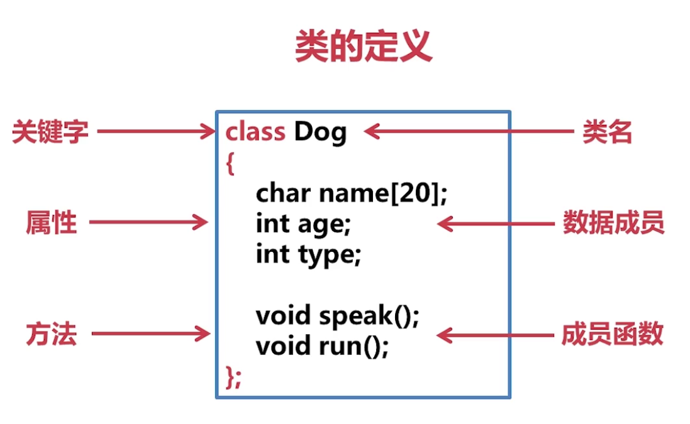

# 	C++ 远征之封装篇

<a href="README.md">目录</a>


构造函数&析构函数

对象复制&对象赋值

对象数组&对象指针

this 指针

### 类的定义

> 数据成员&成员函数



访问限定符：

- public： 公共的
- protected： 受保护的
- private： 私有的

#### 实例化类对象

类可以实例化多个对象，实例化对象的方式一般有两种：

1、 从栈中实例化

```cpp
class TV{
public:
	char name[20];
	int type;

	void changeVol();
	void power();
};

int main(void){
	TV tv;
	TV tv[20];

	return 0;
}
```

2、 从堆中实例化

```cpp
class TV{
public:
	char name[20];
	int type;

	void changeVol();
	void power();
};

int main(void){
	TV *p = new TV();
	TV *q = new TV[20];

	// todo

	delete p;
	delete []q;

	return 0;
}
```

#### 对象成员访问

```cpp
// 单一成员
int main(void){
	TV tv;
	tv.type = 0;
	tv.changeVol();
	return 0;
}

int main(void){
	TV *p = new TV();
	p->type = 0;
	p->changeVol();
	delete p;
	p = NULL;
	return 0;
}
```

```cpp
// 数组成员
int main(void){
	TV tv;
	tv.type = 0;
	tv.changeVol();
	return 0;
}

int main(void){
	TV *p = new TV[5];
	for (int i = 0; i < 5; i++){
		p[i]->type = 0;
		p[i]->changeVol();
	}
	delete []p;
	p = NULL;
	return 0;
}
```

#### 实例化类对象

```cpp
#include <iostream>
#include <stdlib.h>
using namespace std;

class Coordinate{
public:
	int x;
	int y;

	void printX(){
		cout << x << endl;
	}
	void printY(){
		cout << y << endl;
	}
};

int main(void){
	// 栈
	Coordinate Coor;
	Coor.x = 10;
	Coor.y = 20;
	Coor.printX();
	Coor.printY();

	// 堆
	Coordinate *p = new Coordinate();  // 申请内存失败，返回NULL
	if (NULL == p){
		// failed 申请内存失败，直接返回
		return 0;
	}
	p->x = 100;
	p->y = 200;
	p->printX();
	p->printY();
	// 清空内存
	delete p;
	p = NULL;

	system("pause");
	return 0;
}
```

### string 类型

```cpp
#include <iostream>
#include <string>
using namespace std;

int main(){
	string name = "roy";
	string hobby("football");
	cout << name << hobby << endl;
	return 0;
}
```

| 				初始化 string 对象的方式:	|				|
|-----------------------|-------------------------------|
| string s1; 			| s1 为空字符串 					|
| string s2("ABC"); 	| 用字符串字面值初始化s2 			|
| string s3(s2); 		| 将s3初始化为s2的一个副本 		|
| string s4(n,'c'); 	| 将s4初始化为字符'c'的n个副本 	|

|				string 的常用操作:		|				|
|---------------|---------------------------------------|
| s.empty() 	| 若s为空字符串，则返回true，否则返回false	|
| s.size() 		| 返回s中字符的个数 						|
| s[n] 			| 返回s中位置为n的字符，位置从0开始 		|
| s1+s2 		| 将来两个串连接成新串，返回新生成的串 		|
| s1 = s2 		| 把s1得内容替换为s2的副本 				|
| v1 == s2 		| 判定相等，相等返回true，否则返回false 	|
| v1 != s2 		| 判定不等，不等返回true，否则返回false 	|

```cpp
#include <iostream>
#include <stdlib.h>
using namespace std;

/*****
 * 题目描述：
 *          1. 提示用户输入姓名
 *          2. 接收用户的输入
 *          3. 向用户问好： hello name
 *          4. 用户名字的长度
 *          5. 告诉用户名字首字母是什么
 *          6. 如果用户直接输入回车，那么告诉用户的输入为空。
 *          7. 如果用户输入的是admin，告诉用户的角色是一个管理员账户
 *****/

int main(void){
    cout << "请输入用户名：";
    string username;
    getline(cin,username);

    if(username.empty()){
        cout << " enter name cannot be empty X" << endl;
        return 0;
    }
    if(username == "admin"){
        cout << "you is a admin !" << endl;
    }
    cout << "hello " + username << endl;
    cout << "your name length is : "  <<  username.size() << endl;
    cout << "your name isitials is : " << username[0] << endl;
    return 0;
}

```

### 数据的封装

```cpp
#include <iostream>
#include <stdlib.h>
#include <string>
using namespace std;

/****
	* 	 数据的封装
	* 定义一个Student类，含有如下信息：
	* 1、姓名： name
	* 2、性别： gender
	* 3、学分（只读）： score
	* 4、学习： study
	*
 ****/

class Student{
// 公共的
public:
	// 设置姓名
	void setName(string _name){
		m_strName = _name;
	}
	// 获取姓名
	string getName(){
		return m_strName;
	}
	// 设置性别
	void setGender(string _gender){
		m_strGender = _gender;
	}
	// 获取性别
	string getGender(){
		return m_strGender;
	}
	// 获取学分
	int getScore(){
		return m_iScore;
	}
	// 初始化学分 0
	void initScore(){
		m_iScore = 0;
	}
	// 增加学分
	void study(int _score){
		m_iScore += _score
	}
// 私有的
private:
	string m_strName;
	string m_strGender;
	int m_iScore;
};
int main(void){
	Student stu;
	stu.initScore();
	stu.setName("roy");
	stu.setGender("男");
	stu.study(30);
	stu.study(50);

	cout << stu.getName() << " " << stu.getGender() << "" << stu.getScore() << endl;

	return 0;
}
```

#### 类外定义

类内定义与内联函数

1、 内联函数

关键字: `inline`

```cpp
inline void fun(){
	cout << "Hello" << endl;
}
```

> 内联函数与普通函数的区别

- 普通函数

		main() --> 调用fun() --> 寻找函数的入口 --> 运行函数相关的代码 --> 运行完以后回到fun()，然后去执行其它代码 --> 结束

- 内联函数

**编译时将函数体代码和实参代替函数调用语句**

__内联函数只执行比较简单的函数，编辑器会拒绝按照内联的方式编译复杂的函数__

2、 类内定义

> 成员函数在类的内部(里边)


```cpp
class Student{
public:
	void setAge(int _age){ // 这三个函数就是类内定义。由于函数比较简单，编译器会自动将其编译为内联函数。
		age = _age
	}
	int getAge(){ // 这三个函数就是类内定义。由于函数比较简单，编译器会自动将其编译为内联函数。
		return age;
	}
	void study(){ // 这三个函数就是类内定义。由于函数比较简单，编译器会自动将其编译为内联函数。
	// todo
	}

private:
	string name;
	int age;
}
```

3、 类外定义

> 成员函数在类的外部(外边)
> 类外定义分为： 同文件类外定义、分文件类外定义

- 同文件类外定义

```cpp
// Car.cpp
class Car{
public:
	void run();
	void stop();
	void changeSpeed();
};
void Car::run(){}
void Car::stop(){}
void Cat::changeSpeed(){}
```

- 分文件类外定义

```cpp
// Car.h 头文件
class Car{
public:
	void run();
	void stop();
	void changeSpeed();
};

// Car.cpp
#include "Car.h"
void Car::run(){}
void Car::stop(){}
void Car::changeSpeed(){}
```

例子：

1.同文件类外定义

```cpp
// demo.cpp
#include <iostream>
#include <stdlib.h>
using namespace std;

/*
	定义一个 Teacher类， 要求分别采用同文件类外定义和分文件类外定义的方式完成，具体要求如下：
	数据成员：
		名字
		年龄
		性别
	成员函数：
		数据成员的封装函数
		授课teach
 */

class Teacher{
public:
	void setName(string _name);
	string getName();
	void setGender(string _gender);
	string getGender();
	void setAge(int _age);
	int getAge();
	void speak();

private:
	string m_strName;
	string m_strGender;
	int m_iAge;

};

void Teacher::setName(string _name){
	m_strName = _name;
}
string Teacher::getName(){
	return m_strName;
}

void Teacher::setGender(string _gender){
	m_strGender = _gender;
}
string Teacher::getGender(){
	return m_strGender;
}

void Teacher::setAge(int _age){
	m_iAge = _age;
}
int Teacher::getAge(){
	return m_iAge;
}

void Teacher::speak(){
	cout << "現在上課……" << endl;
}

int main(void){
	Teacher t;
	t.setName("孔子");
	t.setGender("男");
	t.setAge(30);
	cout << t.getName() << "" << t.getAge() << "" << t.getGender() << endl;
	t.speak();
	return 0;
}
```
2.分文件类外定义

```cpp
// demo.h
#include <iostream>
#include <stdlib.h>
using namespace std;

class Teacher{
public:
	void setName(string _name);
	string getName();
	void setGender(string _gender);
	string getGender();
	void setAge(int _age);
	int getAge();
	void speak();

private:
	string m_strName;
	string m_strGender;
	int m_iAge;

};
// demo.cpp
#include <iostream>
#include <stdlib.h>
#include "demo.h"
using namespace std;

/*
	定义一个 Teacher类， 要求分别采用同文件类外定义和分文件类外定义的方式完成，具体要求如下：
	数据成员：
		名字
		年龄
		性别
	成员函数：
		数据成员的封装函数
		授课teach
 */

void Teacher::setName(string _name){
	m_strName = _name;
}
string Teacher::getName(){
	return m_strName;
}

void Teacher::setGender(string _gender){
	m_strGender = _gender;
}
string Teacher::getGender(){
	return m_strGender;
}

void Teacher::setAge(int _age){
	m_iAge = _age;
}
int Teacher::getAge(){
	return m_iAge;
}

void Teacher::speak(){
	cout << "現在上課……" << endl;
}

int main(void){
	Teacher t;
	t.setName("孔子");
	t.setGender("男");
	t.setAge(30);
	cout << t.getName() << "" << t.getAge() << "" << t.getGender() << endl;
	t.speak();
	return 0;
}
```


### 对象结构

内存分区

**栈区：** `int x = 0; int *p = NULL;`

**堆区：** `int *p = new int[20];`

**全局区： 存储全局变量及静态变量**

**常量区：** `string str = "hello";`

**代码区： 存储逻辑代码的二进制**


```cpp
class Car{
private:
	int wheelCount;
public:
	int getWheelCoutn(){
		return wheelCount;
	}
}
```

**对象初始化**

```cpp
class Tank{
private:
	int m_iPosX;
	int m_iPosY;
public:
	void init(){
		m_iPosX = 0;
		m_iPosY = 0;
	}
};
int main(void){
	Tank t1;
	t1.init();
	Tank t2;
	t2.init();

	return 0;
}
```

> 对象初始化：1.有且只有一次，2.根据条件初始化


构造函数的规则和特点：

- 构造函数在对象实例化时被自动调用
- 构造函数与类同名
- 构造函数没有返回值
- 构造函数可以有多个重载形式
- 实例化对象时仅用到一个构造函数
- 当用户没有定义构造函数时，编译器自动生成一个构造函数

> 无参构造函数

```cpp
class Student{
public:
	Student(){ // 无参构造函数的函数名与类名相同，无参构造函数没有返回值
		m_strName = "jim"
	}
private:
	string m_strName;
};
```

> 有参构造函数

```cpp
class Student{
public:
	Student(string name){ // 字符串类型的name就是有参构造函数的参数
		m_strName = name;
	}
private:
	string m_strName;
};
```

> 重载构造函数

```cpp
class Student{
public:
	Student(){
		m_strName = "jim";
	}
	Student(string name){
		m_strName = name;
	}
private:
	string m_strName;
};
```

**构造函数代码实例**

```cpp
// demo.cpp
#include <iostream>
#include <stdlib.h>
#include <string>
#include "Teacher.h"

using namespace std;

/*
	Teacher类
		自定义无参构造函数
		自动以有参构造函数
	数据：
		名字
		年龄
	成员函数：
		数据成员的封装函数
 */

int main(void){
	Teacher t1;
	Teacher t2("Merry",15);
	Teacher t3("James");

	cout << t1.getName() << " " << t1.getAge() << endl;
	cout << t2.getName() << " " << t2.getAge() << endl;
	cout << t3.getName() << " " << t3.getAge() << endl;
	return 0;
};


// Teacher.cpp
#include "Teacher.h"

Teacher::Teacher(){
	m_strName = "jim";
	m_iAge = 5;
	cout << "Teacher()" << endl;
}

Teacher::Teacher(string name,int age){
	m_strName = name;
	m_iAge = age;
	cout << "Teacher(string name,int age)" << endl;
}

void Teacher::setName(string name){
	m_strName = name;
}
string Teacher::getName(){
	return m_strName;
}

void Teacher::setAge(int age){
	m_iAge = age;
}
int Teacher::getAge(){
	return m_iAge;
}


// Teacher.h
#include <iostream>
#include <string>

using namespace std;

class Teacher{
public:
	Teacher();
	Teacher(string name,int age = 18);
	void setName(string name);
	string getName();
	void setAge(int age);
	int getAge();
private:
	string m_strName;
	int m_iAge;
};
```

**默认构造函数(实例化时不需要传递参数的函数是默认构造函数)**

```cpp
int main(){
	Student stu1();
	Student *p = NULL;
	p = new Student();

	return 0;
};

//
class Student{
public:
	Student(){};
	// Student(string name);

private:
	string m_strName;
};
```

**构造函数初始化列表**

```cpp
class Student{
public:
	Student():m_strName("jim"),m_iAge(10){};
private:
	string m_strName;
	int m_iAge;
};
```

**构造函数初始化列表特性**

- 初始化列先于构造函数执行
- 初始化列表只能用于构造函数
- 初始化列表可以同时初始化多个数据成员

**构造函数初始化列表的必要性**

```cpp
class Circle{
public:
	// Circle(){m_dPi = 3.14};  通过构造函数的方式会报错
	Circle():m_dPi(3.14){} // 通过初始化列表的方式才能成功
private:
	const double m_dPi;
}
```

```cpp
// demo.cpp
#include <iostream>
#include <stdlib.h>
#include "Teacher.h"
using namespace std;

/*
	Teacher 类
		自定义有参默认构造函数
		使用初始化列表初始化数据
	数据：
		名字
		年龄
	成员函数：
		数据成员的封装函数
	拓展：
		定义可以带最多学生的个数，此为常量
 */

int main(void){
	Teacher t1("Merry",12,150);
	cout << t1.getName() << " " << t1.getAge() << " " << t1.getMax() << endl;

	return 0;
};

// Teacher.cpp
#include <Teacher.h>

Teacher::Teacher(string name,int age,int m):m_strName(name),m_iAge(age),m_iMax(m){
	cout << "Teacher(string name,int age,int m)" << endl;
}

void Teacher::setName(string name){
	m_strName = name;
}
string Teacher::getName(){
	return m_strName;
}

void Teacher::setAge(int age){
	m_iAge = age;
}
string Teacher::getAge(){
	return m_iAge;
}

int Teacher::getMax(){
	return m_iMax;
}

// Teacher.h
#include <iostream>
#include <string>
using namespace std;

class Teacher{
public:
	Teacher(string name = "Jim",int age = 1,int m = 100)
	void setName(string name);
	string getName();
	void setAge(int age);
	int getAge();
	int getMax();
private:
	string m_strName;
	int m_iAge;
	const int m_iMax;
};
```

**拷贝构造函数**

- 如果没有自定义的拷贝构造函数则系统自动生成一个默认的拷贝构造函数

- 当采用直接初始化或复制初始化实例化对象时系统自动调用拷贝构造函数

- 拷贝构造函数不可以重载


定义格式： 类名（const类名 & 变量名）

```cpp
class Student{
public:
	Student(){
		m_strName = "jim";
	}
	Student(const Student & stu){ }
private:
	string m_strName;
};
```


```cpp
#include <iostream>
#include <stdlib.h>
#include <string>
#include "Teacher.h"

using namespace std;

/*
	Teacher类
		自定义拷贝构造函数
	数据：
		名字
		年龄
	成员函数：
		数据成员的封装函数
 */

int main(void){
	Teacher t1;
	Teacher t2 = t1; 	// 调用拷贝构造函数
	Teacher t3(t1); 	// 调用拷贝构造函数

	return 0;
}
// Teacher.cpp

#include <Teacher.h>

Teacher::Teacher(string name,int age):m_strName(name),m_iAge(age){
	cout << "Teacher(string name,int age)" << endl;
}

Teacher::Teacher(const Teacher & tea){
	cout << "Teacher(const Teacher & tea)" << endl;
}

void Teacher::setName(string name){
	m_strName = name;
}
string Teacher::getName(){
	return m_strName;
}

void Teacher::setAge(int age){
	m_iAge = age;
}
string Teacher::getAge(){
	return m_iAge;
}


// Teacher.h
#include <iostream>
#include <string>
using namespace std;
class Teacher{
public:
	Teacher(string name = "jim", int age = 1);
	Teacher(const Teacher & tea)
	void setName(string name);
	string getName();
	void setAge(int age);
	int getAge();
private:
	string m_strName;
	int m_iAge;
};
```

**析构函数**

- 如果没有自定义的析构函数则系统自动生成一个析构函数

- 析构函数在对象销毁时自动调用

- 析构函数没有返回值，没有参数也不能重载


定义格式： `~类名()`

```cpp
class Student{
public:
	Student(){
		cout << "Student" << endl;
	}
	~Student(){ // 析构函数没有参数
		cout << "~Student" << endl;
	}
private:
	string m_strName;
}

//
class Student{
public:
	Student(){
		m_pName = new char[20];
	}
	~Student(){ // 析构函数的唯一作用就是释放资源
		delete []m_pName;
	}
private:
	char *m_pName;
}
```

对象的生命历程

	申请内存 --> 初始化列表 --> 构造函数
		↑						|
		↓						↓
	释放内存 <-- 析构函数 <--- 参与运算

```cpp
// demo
#include <iostream>
#include <stdlib.h>
#include <string>
#include "Teacher.h"
using namespace std;

/*
	Teacher类
		1. 自定义析构函数
		2. 普通方式实例化的对象，在销毁对象时是否自动调用析构函数
		3. 通过拷贝析构函数实例化独享，在销毁对象是 是否调用析构函数
	数据：
		名字
		年龄
	成员函数：
		数据成员的封装函数
 */

int main(void){
	Teacher t1; 	// 栈
	Teacher *p = new Teacher();		// 堆
	delete p;

	Teacher t2(t1); // 拷贝构造函数


	return 0;
};

// Teacher.cpp
#include <Teacher.h>

Teacher::Teacher(string name,int age):m_strName(name),m_iAge(age){
	cout << "Teacher(string name,int age)" << endl;
}

Teacher::Teacher(const Teacher & tea){
	cout << "Teacher(const Teacher & tea)" << endl;
}
Teacher::~Teacher(){
	cout << "~Teacher()" << endl;
}
void Teacher::setName(string name){
	m_strName = name;
}
string Teacher::getName(){
	return m_strName;
}

void Teacher::setAge(int age){
	m_iAge = age;
}
string Teacher::getAge(){
	return m_iAge;
}


// Teacher.h
#include <iostream>
#include <string>
using namespace std;
class Teacher{
public:
	Teacher(string name = "jim", int age = 1);
	Teacher(const Teacher & tea);
	~Teacher();
	void setName(string name);
	string getName();
	void setAge(int age);
	int getAge();
private:
	string m_strName;
	int m_iAge;
};
```


<a href="4-inherit.md">C++ 远征之继承篇</a>
