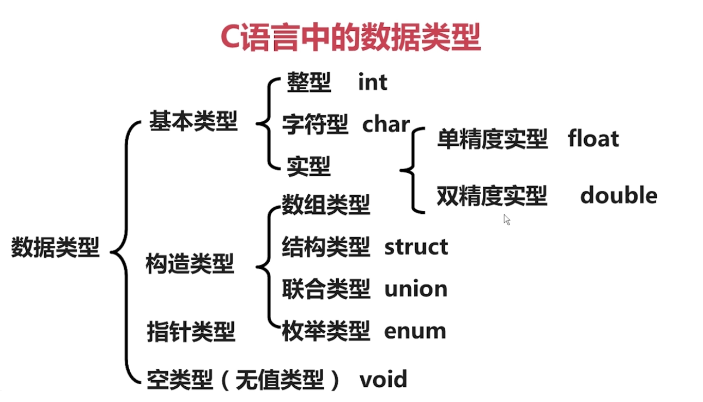

# C++ 远征之起航篇

<a href="README.md">目录</a>

<details>
  <summary>C++ 诞生地</summary>
  
</details>
<details>
  <summary>C++ 之父</summary>
  
</details>


C++ 初体验

```c++
#include<iostream>
using namespace std;    //关于这里，且听下回分解
int main()
{
   cout<<"Hello word"<<endl;  //在此填写我们的开篇Hello word
   return 0;
}
```

### C++ 基础知识

#### 1、 数据类型

<details>
  <summary><strong>C语言的数据类型</strong></summary>
  
</details>

C++ 中新的数据类型

| 	| 逻辑类型 	| 真 	| 假 	|
|---|-----------|-------|-------|
| C 	| 没提供 | 非0 	| 0 	|
| C++	| bool 	| true 	| false	|

对比**C**与**C++** `bool`类型
```C
// C 语言
int flag = 0;
if(flag == 1){
	// to do
}else{
	// to do
}
```
```C++
// C++ 语言
int flag = 0;
if(flag){
	// to do
}else{
	// to do
}
```
#### 2、 初始化方法

- C 语言提供的初始化方法 `int x = 1024;`

- C++ 提供两种初始化方法:

	1. 复制初始化： `int x = 1024;`

	2. 直接初始化： `int x(1024); //推荐`

#### 3、 随用随定义

- C语言: 所有变量定义必须位于函数体的最前面

- C++： 所有变量随用随定义

对比**C**与**C++** 随用随定义

```C
// C语言
int main()
{
	int v1 = 3;
	int v2 = 4;

	v1 = v1 + v2;
	v2 = v2 + v1;

	return 0;
}
```
```C++
// C++ 语言
int main()
{
	int v1 = 3;
	v1 = v1 + v2;

	int v2 = 4;
	v2 = v2 + v1;

	return 0;
}
```

### C++ 输入输出方式

> 对比**C**与**C++**的输入输出方式

<details>
	<summary>C语言的I/O方式</summary>
	
</details>
<details>
	<summary>C++的I/O方式</summary>
	
</details>


**C++ 的I/O方式**

`cout输出` 语法形式：
```C++
cout << C << endl;
cout <<"x + y ="<< x + y << endl;
// endl`代表回车(\n)
```

`cin输入` 语法形式：
```C++
cin >> x;
cin >> x >> y;
```

优点：

- 不用关注占位符
- 不用关注数据类型
- 不易出现问题

**C++ 输入输出特性演示**

```C++
#include <iostream>
#include <stdlib.h> // 这里存着 system() 函数
using namespace std;

// 要求：
// 1. 提示用户输入一个整数，将该整数分别以8进制，10进制，16进制打印在屏幕上
// 2. 提示用户输入一个布尔值（0或1），以布尔方式将值打印在屏幕上

int main(){
	cout << "请输入一个整数："<< endl;
	int x = 0;
	cin >> x;
	cout << oct << x << endl; // 8进制
	cout << dec << x << endl; // 10进制
	cout << hex << x << endl; // 16进制

	cout << "请输入一个布尔值(0 or 1):" << endl;
	bool y = false;
	cin >> y;
	cout << boolalpha << y << endl;

	system("pause");
	return 0;
}
```

### C++ 命名空间(namespace)

命名空间关键字： `namespace`

```C++
#include <stdlib.h>
#include <iostream>
using namespace std; // 调用 std 命名空间

namespace A
{
	int x = 1;
	void fun(){
		cout << "A function" << endl;
	}
}

namespace B
{
	int x = 2;
	void fun(){
		cout << "B function" << endl;
	}
	void fun2(){
		cout << "2B function" << endl;
	}
}

using namespace B; // 默认使用 B 命名空间
int main(void){
	cout << A::x << endl; // 输出 A 命名空间下的 x 变量
	B::fun();			  // 调用 B 命名空间下的 fun 函数
	fun2();			  	  // 调用 B(默认) 命名空间下的 fun2 函数
	system("pause");
	return 0;
}
```

#### 综合题

```C++
/********************************************************/
/* 知识点：bool类型，命名空间，输入输出                 */
/* 题目要求：                                           */
/*      使用一个函数找出一个整型数组中的最大值或最小值  */
/********************************************************/

#include <stdlib.h>
#include <iostream>
using namespace std;

int getMaxOrMin(int *arr,int count,bool isMax){
	int temp = arr[0]; // 获取数组的第一个元素
	for(int i = 1;i < count;i++){
	    if(isMax){
	    	if(temp < arr[i]){
	    	        temp = arr[i];
	    	}
	    }else{
	        if(temp > arr[i]){
	                temp = arr[i];
	        }
	    }
	}
	return temp;
}

int main(void){
	int arr1[4] = {3,5,1,7};
	cout << "求值(1:最大值，0:最小值): ";
	bool isMax = false;
	cin >> isMax;
	cout << getMaxOrMin(arr1,4,isMax) << endl;
	system("pause");
	return 0;
}
```

<a href="2-departure.md">C++ 远征之离港篇</a>